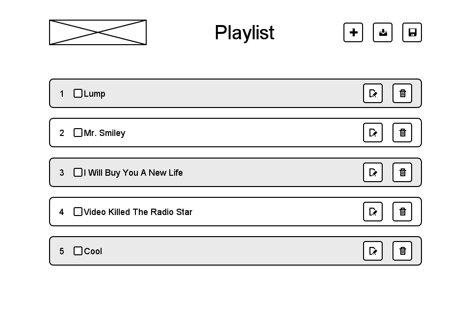

# Nearsoft Front End Pair Programming

> "We must believe in luck. For how else can we explain the success of those we don't like?" <br> *Jean Cocteau*

## Requirements

* [Node.js](https://nodejs.org)
* Text editor or IDE.
* [Modern browser](http://browsehappy.com).
* Screensharing software (e.g. [Google Hangouts](https://plus.google.com/hangouts)).
* Good internet connection.

## Notes

**You have 1.5 hours to complete as much done as you can**

But do take your time. The idea is to showcase how you work, not to finish everything with 100% code coverage. Although that would be impressive.

**Unless instructed, you're not allowed to move on to the next part until the current one is complete.**

You should aim for a "look and feel" and behavior that is as close to the spec as possible. Pixel perfect is old fashioned and overkill.

**Asking questions is allowed and encouraged.**

The interviewers are here to guide you and help answer your questions. Not sure about something? Ask them.

**Searching online is allowed.**

Because sometimes we feel better getting answers ourselves.

**Best coding practices are encouraged.**

Don't let the time constraint stop you from coding the best you can.

**Using JavaScript libraries is allowed.**

Feel free to use a DOM or MV* library. The more structure the better. Vanilla JavaScript is fine too.

**Using library plugins, UI libraries or CSS frameworks is not allowed.**

We want to see how you come up with solutions and how great you can write code. For this reason, we don't allow solutions that provide drop-in cookbook ready code (e.g. Bootstrap CSS, jQuery UI, etc.).

## Get ready

1. Go to the extracted folder and install dependencies: `npm install --production`
2. Run the server: `npm start`
3. Open your browser and go to: `http://localhost:1984`

## Part 1: HTML & CSS (30min)

> Colors, like features, follow the changes of the emotions. <br> *Pablo Picasso*

### Spec

1. The app should have a header with:
  1. The Nearsoft logo
  2. The name of the app
  3. A group of actions: add, load and save
2. The app should have a body with a list of items.
3. An item should have a number depending on its position on the list.
4. An item should have a checkbox that determines its state.
5. An item should have a name.
6. An item should have a two actions: edit and delete.
7. An odd-numbered item should have a dark background color.
8. An even-numbered item should have a bright background color.

### Implementation notes

Inside the `public/icons` folder there is a ready-to-use custom build of an icon font. Open
`demo.html` for more details.

For layout details check out the wireframe:



## Part 2: DOM Scripting (30min)

> He gains everyone's approval who mixes the pleasant with the useful. <br> *Horace*

### Spec

1. The add action should add a new item to the end of the list.
2. The edit action should edit the item's name.
3. The delete action should delete the item from the list.
4. The item should be strikethrough when its checkbox is selected.

## Part 3: Ajax Scripting (30min)

> You cannot travel on the path until you become the path itself. <br> *Buddha*

### Spec

1. The load action should load a list of items into the current list.
2. The save action should save the current list of items.

### Implementation notes

#### Load

A `GET` HTTP request should be made to: `/api/load`

The response will be:

```javascript
{
  "items": [
    {
      "name": "Loaded item 1",
      "checked": true
    },
    {
      "name": "Loaded item 2",
      "checked": false
    },
    // ... etc.
  ]
}
```

The service will always return the same when responding to `/api/load`

#### Save

A `POST` HTTP request should be made to: `/api/save`

The request should be an object with an `items` member that is an array of objects with key-value pairs `name` and `checked`.

`name` (string) will be the name of the item and `checked` (boolean) will be the value of whether the item is checked or not.

```javascript
{
  "items": [
    {
      "name": "New item 1",
      "checked": false
    },
    {
      "name": "New item 2",
      "checked": true
    },
    // ... etc.
  ]
}
```

If the request satisfies all the above an HTTP status code of `200` (OK) will be sent back along with the request object.

The service will not actually persist what you send.

## Part 4: Unit Testing

> Courage is not simply one of the virtues but the form of every virtue at the testing point, which means at the point of highest reality. <br> *C. S. Lewis*

### Spec

Write unit tests for your code.
